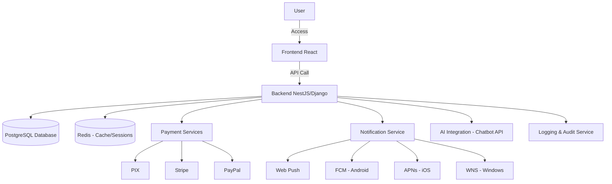

# Billing Platform — README (EN-US)

## 🚀 Overview
Modern, multilingual billing platform (pt-BR, en, es, ru), accessible and secure, supporting payments (PIX, credit card, boleto, crypto), real-time notifications, AI-powered chat, and referral system.

---

## 🏗️ System Architecture

---

## ⚙️ Tech Stack
- **Frontend**: React + TailwindCSS  
- **Backend**: NestJS (TypeScript) or Django (Python)  
- **Database**: PostgreSQL, Redis  
- **Messaging/Queues**: Kafka or RabbitMQ  
- **Infrastructure**: Docker, Kubernetes, CI/CD  
- **AI**: API integration (OpenAI, Anthropic, or self-hosted)

---

## 🔑 Features
- Secure authentication (2FA, OAuth)  
- Advanced admin dashboard with roles/permissions  
- Billing, payments, and digital wallet  
- Cashback & referral system  
- AI-powered chat + human support fallback  
- Real-time notifications (Web/Mobile/Desktop)  
- Accessibility WCAG 2.1 AA  
- Logs & audit trail, LGPD/GDPR compliance  

---

## 📸 Previews
  
  

---

## 📢 Notifications
- Cross-platform push (Web, Android, iOS, Windows)  
- User-configurable preferences  

---

## 🔐 Security
- OWASP Top 10 mitigations  
- TLS 1.3 + AES-256 encryption  
- Rate limiting, WAF & pentests  
- Browser code inspection blocking (attempted)  

---

## 🤝 Contribution
Pull requests are welcome. Before contributing, please read the `CONTRIBUTING.md` guidelines (to be created).

---

## 📄 License
This project is licensed under MIT. See [LICENSE](LICENSE).

