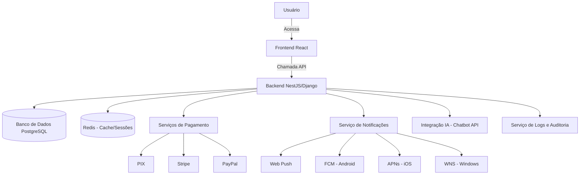

# Plataforma de Cobranças — README (PT-BR)

## 🚀 Visão Geral
Plataforma de cobranças moderna, multilíngue (pt-BR, en, es, ru), acessível e segura, com suporte a pagamentos (PIX, cartão, boleto, cripto), notificações em tempo real, chat com IA e sistema de indicações.

---

## 🏗️ Arquitetura do Sistema

---

## ⚙️ Stack Tecnológica
- **Frontend**: React + TailwindCSS  
- **Backend**: NestJS (TypeScript) ou Django (Python)  
- **Banco de Dados**: PostgreSQL, Redis  
- **Mensageria/Filas**: Kafka ou RabbitMQ  
- **Infra**: Docker, Kubernetes, CI/CD  
- **IA**: Integração via API (OpenAI, Anthropic ou self-hosted)

---

## 🔑 Funcionalidades
- Autenticação segura (2FA, OAuth)  
- Painel administrativo com permissões avançadas  
- Cobranças, pagamentos e carteira digital  
- Cashback e sistema de indicações  
- Chat com IA + suporte humano  
- Notificações em tempo real (Web/Mobile/Desktop)  
- Acessibilidade WCAG 2.1 AA  
- Logs e auditoria compatíveis com LGPD  

---

## 📸 Pré-visualizações
  
  

---

## 📢 Notificações
- Push cross-platform (Web, Android, iOS, Windows)  
- Preferências configuráveis por usuário  

---

## 🔐 Segurança
- Proteção contra ataques (OWASP Top 10)  
- Criptografia TLS 1.3 + AES-256  
- Rate limiting, WAF e auditorias de segurança  
- Bloqueio de inspeção de código no navegador (tentativa)  

---

## 🤝 Contribuição
Pull requests são bem-vindos. Antes de contribuir, leia as diretrizes em `CONTRIBUTING.md` (a ser criado).

---

## 📄 Licença
Este projeto está sob licença MIT. Veja o arquivo [LICENSE](LICENSE).

